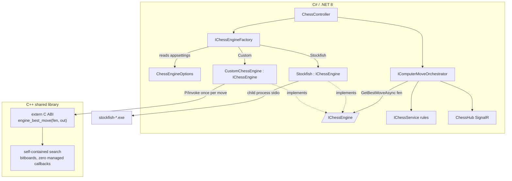
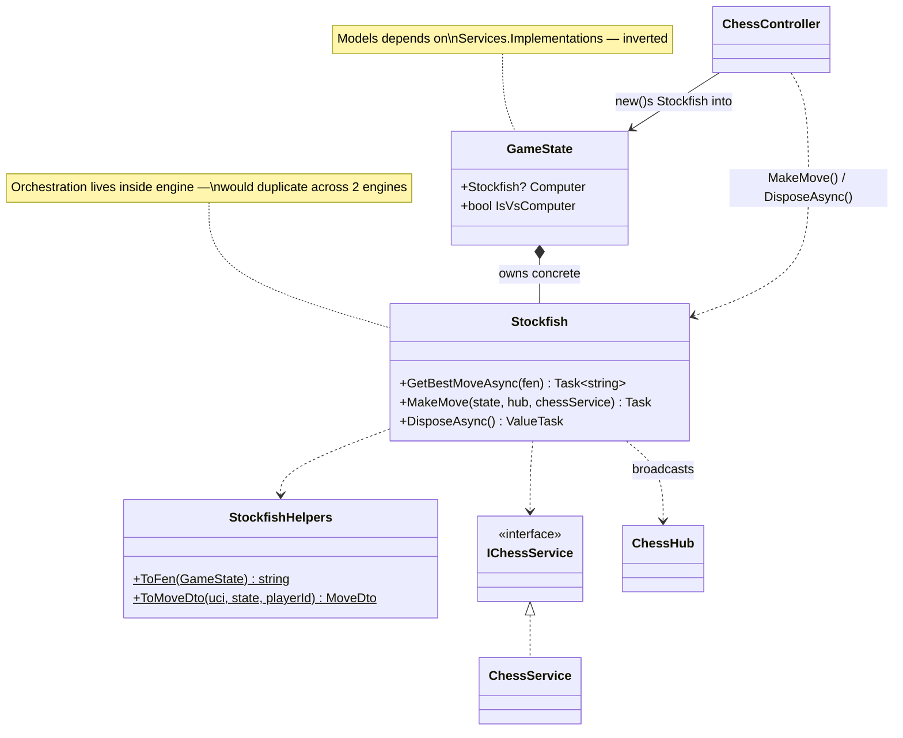
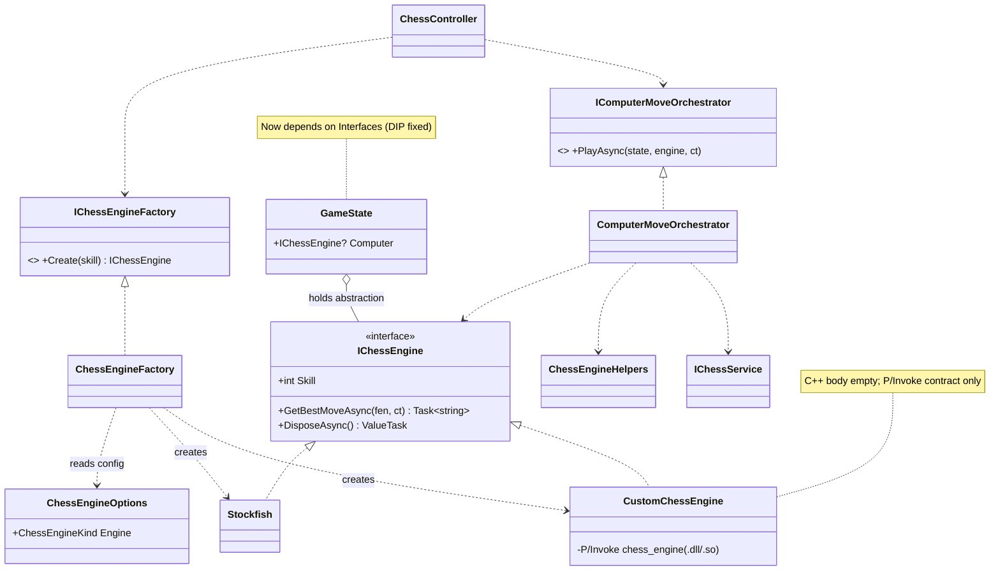
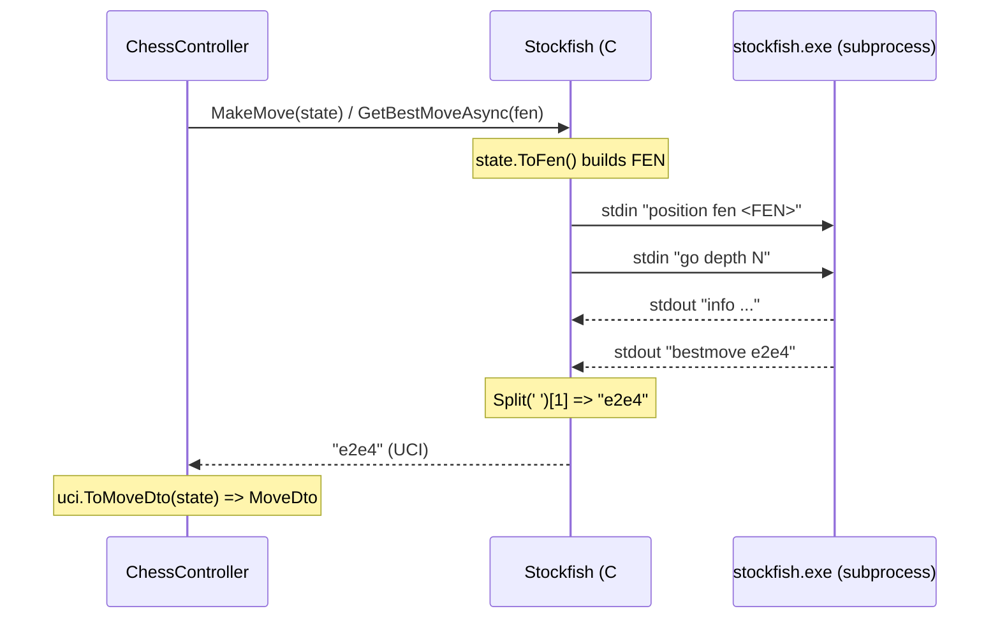
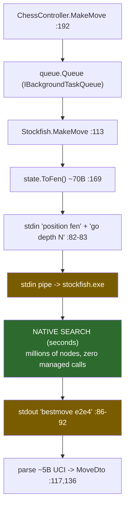
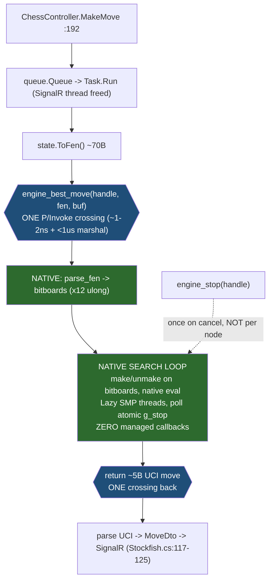
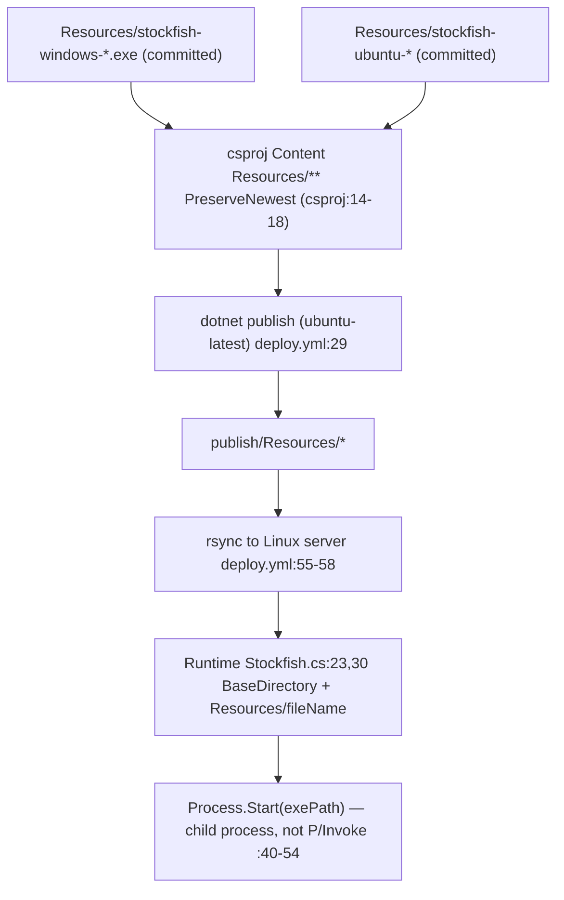
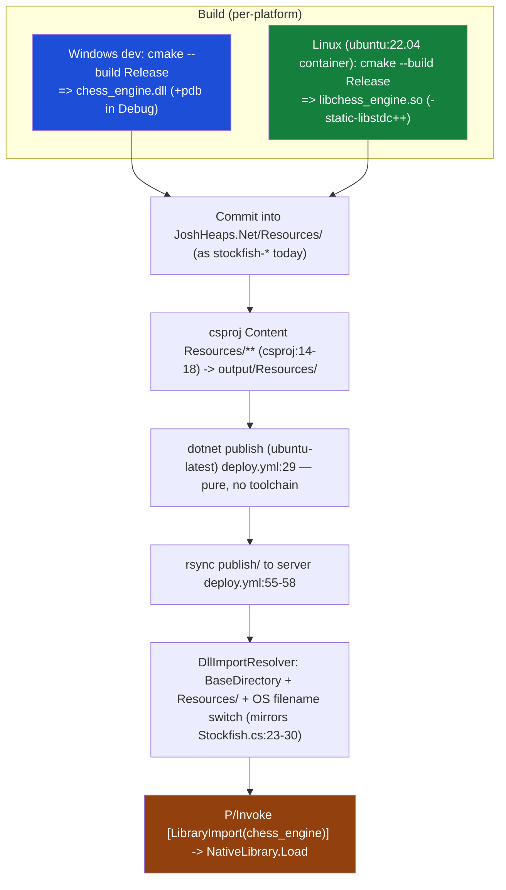
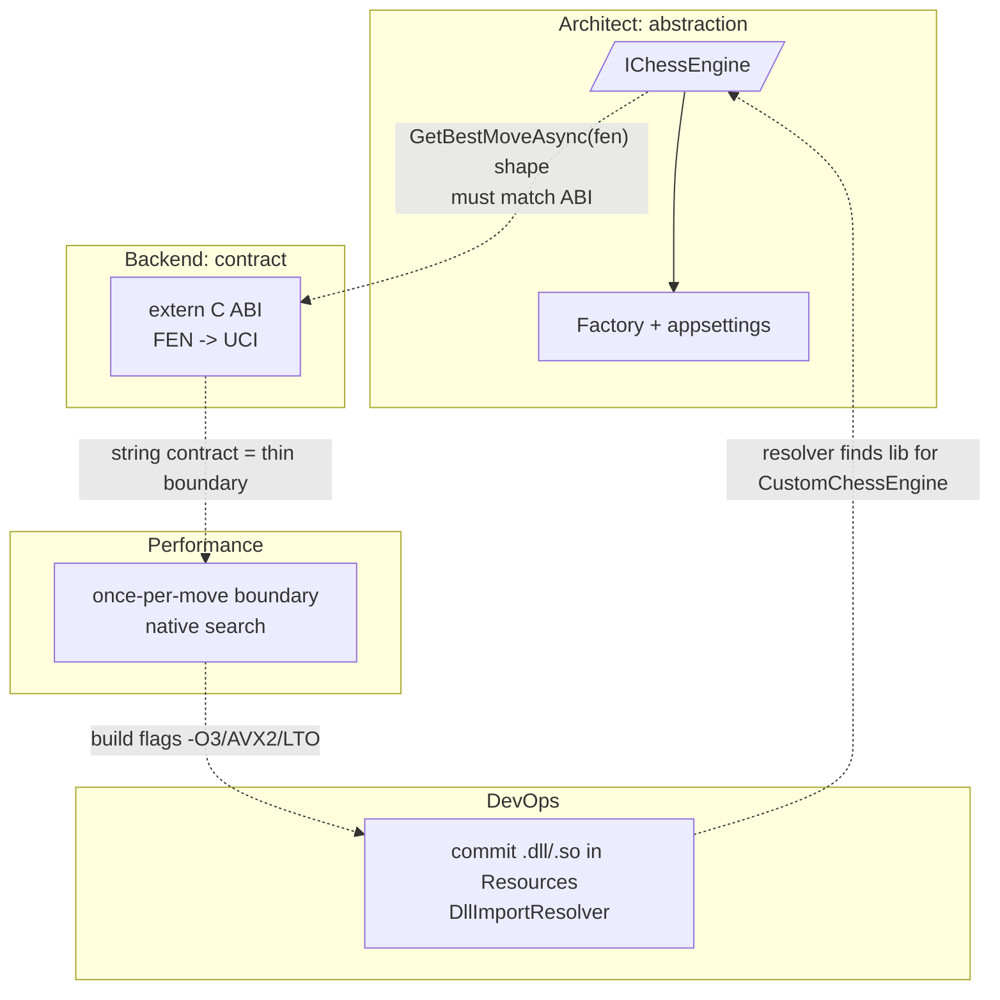

# R&D Findings: Swappable C++ Chess Engine via P/Invoke

**Team:** Architect, Backend Engineer, Performance Engineer, DevOps Engineer (orchestrated by team lead)
**Date:** 2026-05-28
**Status:** Complete — engine *infrastructure* design only; the C++ search logic is intentionally left as an empty, compilable stub for the user to implement.

---

## Executive Summary

We investigated how to host a custom chess engine written in C++ (compiled to `chess_engine.dll` for local Windows debugging and `libchess_engine.so` for the Linux server) behind a C# "middleman" wrapper that shares an interface with the existing `Stockfish.cs`, so the two are swappable by config. The key conclusion: the existing engine already uses a **string contract (FEN in → UCI move out)**, so the cleanest design mirrors it exactly — an opaque-handle `extern "C"` ABI, a `[LibraryImport]` P/Invoke wrapper, and a new `IChessEngine` interface that both `Stockfish` and the new `CustomChessEngine` implement, selected by a factory reading `appsettings`. The recommended next step is to land the **infrastructure** (interface, factory, P/Invoke wrapper, CMake project, empty C++ stub, build/packaging) and verify the round trip end-to-end with the stub returning a placeholder move — *before* any chess logic is written.

> **Naming reconciliation:** the specialists used varying names for the native lib (`ChessEngine`, `chessengine`, `chess_engine`). This document standardizes on **logical name `chess_engine`** → `chess_engine.dll` (Windows) / `libchess_engine.so` (Linux), matching the Backend and DevOps proposals. Adjust the snippets from the Architect/Performance sections accordingly.

### High-Level Architecture



---

## Findings by Area

### Architect: Engine Abstraction & Swap Mechanism

#### Current State

Two distinct concerns are easy to confuse:

- **`IChessService` / `ChessService`** — the *rules engine* (move legality, check/mate). NOT the thing being swapped. `JoshHeaps.Net\Services\Interfaces\IChessService.cs:5-11`, `ChessService.cs:6`.
- **`Stockfish`** — the *AI move-selection engine* (the thing being swapped). `Services\Implementations\Stockfish.cs:13`.

`Stockfish` is a concrete `sealed` class with **no interface**, carrying three mixed responsibilities:

1. **Engine lifecycle/IO** — spawns a child process, UCI handshake, `GetBestMoveAsync(fen)`. `Stockfish.cs:13-111`.
2. **Orchestration** — `MakeMove(GameState, IHubContext<ChessHub>, IChessService)` gets a move, converts it, calls the rules service, broadcasts over SignalR. `Stockfish.cs:113-126`. Engine-agnostic glue.
3. **FEN/UCI translation** — `StockfishHelpers.ToFen(...)` / `ToMoveDto(...)`. `Stockfish.cs:129-253`. Also engine-agnostic.

Coupling points where the concrete type leaks:

- `GameState.Computer` typed as concrete `Stockfish?` — domain model → implementation (inverted dependency). `Models\GameState.cs:46`, `using ...Implementations;` at `GameState.cs:1`.
- Controller hand-constructs the engine: `gameState.Computer = new(difficulty);` `Controllers\ChessController.cs:45`. No DI, no abstraction.
- Orchestration via concrete instance: `gameState.Computer.MakeMove(...)` at `ChessController.cs:60` and `:192`.
- Disposal via concrete type: `await game.Computer.DisposeAsync();` `ChessController.cs:248`.
- `Stockfish` is **not** registered in DI; `Program.cs:21-23` registers other services but the engine is `new`-ed inline per game.



#### Findings

1. **No interface → cannot swap.** `Stockfish` is `sealed`, concrete-only (`Stockfish.cs:13`). Adding `CustomChessEngine` today means touching `GameState`, the controller, and disposal. *Impact:* an `IChessEngine` abstraction is the core requirement.
2. **Domain model depends on a concrete service.** `GameState.cs:46` + `using ...Implementations` at `GameState.cs:1`. *Impact:* must become `IChessEngine?` (or leave the model entirely).
3. **Engine hand-constructed in controller, no DI.** `ChessController.cs:45`. *Impact:* engine selection can't be config-driven; this is the seam for a factory.
4. **Orchestration lives in the engine.** `Stockfish.MakeMove(...)` (`Stockfish.cs:113-126`) is not Stockfish-specific. *Impact:* copying it into `CustomChessEngine` duplicates rules-call + broadcast wiring; lift it to an orchestrator.
5. **FEN/UCI translation is engine-agnostic** (`Stockfish.cs:169`, `:131`). *Impact:* keep shared (rename to `ChessEngineHelpers`), don't duplicate.
6. **Engine lifecycle is game-scoped, not DI-scoped.** Created in `CreateGame` (`ChessController.cs:45`), disposed in the game-removal timer (`ChessController.cs:247-248`); the constructor spawns a process and blocks on UCI handshake (`Stockfish.cs:54,72,77`). *Impact:* a plain singleton won't fit — use a **per-game factory** producing disposable instances.
7. **`MakeMove` is fire-and-forget returning non-generic `Task`** (`Stockfish.cs:113`). *Impact:* when lifted, the orchestrator should return the `(MoveDto, MoveResultDto)` it produced (per CodingStyle "Void Avoidance").

#### Suggested Approach

Three roles: `IChessEngine` (swappable contract), `IChessEngineFactory` (per-game creation from config), `IComputerMoveOrchestrator` (lifted glue).

```csharp
// Services/Interfaces/IChessEngine.cs
public interface IChessEngine : IAsyncDisposable
{
    int Skill { get; }
    // UCI long-algebraic, e.g. "e2e4", "e7e8q"
    Task<string> GetBestMoveAsync(string fen, CancellationToken cancellationToken = default);
}
```

```csharp
// Services/Implementations/Stockfish.cs  (minimal change)
public sealed class Stockfish : IChessEngine   // was: IAsyncDisposable
{
    public int Skill => _skill;
    public Task<string> GetBestMoveAsync(string fen, CancellationToken ct = default) { /* existing body */ }
    public ValueTask DisposeAsync() { /* unchanged */ }
    // DELETE MakeMove(...) -> moves to IComputerMoveOrchestrator
}
// StockfishHelpers -> rename to ChessEngineHelpers in Services/Implementations/ChessEngineHelpers.cs (body unchanged)
```

```csharp
// Services/Interfaces/IChessEngineFactory.cs
public interface IChessEngineFactory { IChessEngine Create(int skill); }

// Services/Implementations/ChessEngineFactory.cs
public sealed class ChessEngineFactory(IOptions<ChessEngineOptions> options) : IChessEngineFactory
{
    private readonly ChessEngineKind _kind = options.Value.Engine;
    public IChessEngine Create(int skill) => _kind switch
    {
        ChessEngineKind.Custom    => new CustomChessEngine(skill),
        ChessEngineKind.Stockfish => new Stockfish(skill),
        _ => throw new InvalidOperationException($"Unknown engine '{_kind}'.")
    };
}
public enum ChessEngineKind { Stockfish, Custom }
public sealed class ChessEngineOptions
{
    public const string SectionName = "ChessEngine";
    public ChessEngineKind Engine { get; set; } = ChessEngineKind.Stockfish;
}
```

```csharp
// Program.cs (near :21-23)
builder.Services.Configure<ChessEngineOptions>(configuration.GetSection(ChessEngineOptions.SectionName));
builder.Services.AddSingleton<IChessEngineFactory, ChessEngineFactory>();
builder.Services.AddSingleton<IComputerMoveOrchestrator, ComputerMoveOrchestrator>();
```

```jsonc
// appsettings.json  — flip to "Custom" to swap (override per-env in appsettings.Development.json)
{ "ChessEngine": { "Engine": "Stockfish" } }
```

```csharp
// Services/Implementations/ComputerMoveOrchestrator.cs  (lifted from Stockfish.MakeMove, engine-agnostic)
public interface IComputerMoveOrchestrator
{
    Task<(MoveDto move, MoveResultDto result)> PlayAsync(GameState state, IChessEngine engine, CancellationToken ct = default);
}
public sealed class ComputerMoveOrchestrator(IHubContext<ChessHub> chessHub, IChessService chessService) : IComputerMoveOrchestrator
{
    public async Task<(MoveDto, MoveResultDto)> PlayAsync(GameState state, IChessEngine engine, CancellationToken ct = default)
    {
        var uci = await engine.GetBestMoveAsync(state.ToFen(), ct);
        var move = uci.ToMoveDto(state, state.CurrentPlayer == PieceColor.White ? state.WhitePlayerId : state.BlackPlayerId);
        var result = chessService.MakeMove(state, move);
        await chessHub.Clients.Group(state.GameId.ToString())
            .SendAsync("ReceiveMoveUpdate", state.GameId.ToString(), move, result, ct);
        return (move, result);
    }
}
```

**`GameState.Computer` recommendation:** keep the reference on `GameState` but retype to `IChessEngine?` (fixes Finding 2) — do *not* go full service-injection. Rationale: the engine is a stateful, per-game, disposable resource whose lifetime is managed by `ScheduleRemoveGame` (`ChessController.cs:247-248`); live games live in the controller's static `ConcurrentDictionary` (`ChessController.cs:20`), not DI. Only the engine's *construction* (factory) and *orchestration* (orchestrator) move out.

```csharp
// ChessController changes (inject factory + orchestrator into the primary ctor at :12-15)
gameState.Computer = engineFactory.Create(difficulty);            // was :45 new(difficulty)
await orchestrator.PlayAsync(gameState, gameState.Computer);       // was :60
if (gameState.IsVsComputer && gameState.Computer is not null)      // was :192
    queue.Queue(() => orchestrator.PlayAsync(gameState, gameState.Computer!));
await game.Computer.DisposeAsync();                                // :248 unchanged (IChessEngine : IAsyncDisposable)
```



#### Open Questions

1. Does the custom engine speak FEN-in / UCI-out? (Assumed yes — confirm before locking the interface.)
2. Per-game instance vs shared singleton for the in-process native engine (a `.dll`/`.so` may be cheap enough to share, unlike a Stockfish process).
3. Skill/options surface — `int skill` vs an `EngineOptions` object if tunables diverge from Stockfish's `(skill, hash)` (`Stockfish.cs:20`).
4. Cancellation/timeout — interface has a `CancellationToken` but nothing wires it today (`BackgroundTaskQueue.cs:11` fire-and-forgets).
5. Concurrency — `GetBestMoveAsync` is not re-entrant per instance (single stdout `Channel`, `Stockfish.cs:17`); per-game instances make this moot today.

---

### Backend Engineer: Native Interop & I/O Contract

#### Current State

The load-bearing method is `GetBestMoveAsync(string fen)` at `Stockfish.cs:80-95`: writes `position fen <fen>` + `go depth N` to stdin (`:82-83`), reads stdout until a line starts with `bestmove` (`:88`), returns the second token — a raw UCI string like `e2e4` / `e7e8q` (`:90`). Input is produced by `ToFen()` (`Stockfish.cs:169-214`); output is consumed by `ToMoveDto()` (`Stockfish.cs:131-162`, parses chars `uci[0..4]` into `MoveDto`, `MoveDto.cs:3-20`). Consumer: `ChessController.cs:191-192` queues `gameState.Computer.MakeMove(...)`.

**There is no native interop today.** A repo-wide grep for `DllImport|LibraryImport|NativeLibrary|Marshal|extern` returns only an unrelated hit in vendored `jquery.js`. Project targets `net8.0`, `Nullable=enable`, `ImplicitUsings=enable` (`JoshHeaps.Net.csproj:3-7`).



#### Findings

1. **The boundary is already a pure string pair** (`Stockfish.cs:80,90`). *Impact:* the native ABI should mirror it exactly — `const char* fen` in, `char*` UCI out. No struct marshalling needed.
2. **No `IChessEngine` abstraction; consumers bind the concrete type** (`GameState.cs:46`, `ChessController.cs:191-192`). *Impact:* the middleman implements the Architect's interface; the `GameState` retype is a cross-cutting dependency.
3. **`MakeMove` mixes engine + SignalR/board concerns** (`Stockfish.cs:113-126`). *Impact:* keep it shared (orchestrator), not per-engine. The native-specific surface of `CustomChessEngine` is only `GetBestMoveAsync`.
4. **The UCI string is the contract anchor.** As long as the native engine emits a 4-or-5-char UCI move, the whole downstream pipeline (`MoveDto` → `IChessService.MakeMove` → SignalR) is unchanged (`Stockfish.cs:131,169`).
5. **Resource-shipping pattern is established** (`csproj:14-18` copies `Resources/**`). *Impact:* the `.dll`/`.so` ship the same way.

#### Suggested Approach

**Contract: strings (FEN in / UCI out), not a binary struct.** It is byte-identical to today's contract (so `ToFen`/`ToMoveDto` are untouched); FEN/UCI are stable ASCII (no layout/packing/endianness/enum-width to keep in sync); the user only writes string parsing in C++; per-move data is tiny. **Buffer-ownership rule:** the C# caller owns the output buffer; the engine only writes into it and never allocates returned strings — sidesteps cross-allocator free bugs.

```c
// native/chess_engine/include/chess_engine.h
#ifndef CHESS_ENGINE_H
#define CHESS_ENGINE_H
#include <stddef.h>

#if defined(_WIN32)
  #ifdef CHESS_ENGINE_BUILD
    #define CHESS_API __declspec(dllexport)
  #else
    #define CHESS_API __declspec(dllimport)
  #endif
  #define CHESS_CALL __cdecl
#else
  #define CHESS_API __attribute__((visibility("default")))
  #define CHESS_CALL
#endif

#ifdef __cplusplus
extern "C" {
#endif

typedef struct ChessEngine* EngineHandle;   // opaque; host never dereferences

enum {
    CHESS_OK = 0, CHESS_ERR_NULL_HANDLE = -1, CHESS_ERR_BAD_FEN = -2,
    CHESS_ERR_NO_MOVE = -3, CHESS_ERR_BUFFER = -4, CHESS_ERR_INTERNAL = -5
};

CHESS_API EngineHandle CHESS_CALL engine_create(const char* options);            // options e.g. "skill=20;hash=256" or NULL
CHESS_API int          CHESS_CALL engine_set_option(EngineHandle, const char* name, const char* value);
CHESS_API int          CHESS_CALL engine_best_move(EngineHandle, const char* fen, char* out_buf, int out_len); // writes "e2e4\0"
CHESS_API int          CHESS_CALL engine_version(char* out_buf, int out_len);
CHESS_API void         CHESS_CALL engine_destroy(EngineHandle);                  // safe with NULL

#ifdef __cplusplus
}
#endif
#endif
```

```cpp
// native/chess_engine/src/chess_engine.cpp  — EMPTY stub; compiles, returns placeholder
#define CHESS_ENGINE_BUILD
#include "chess_engine.h"
#include <cstring>
#include <string>

struct ChessEngine { std::string options; };   // put TT, tables, etc. here later

static int copy_out(const char* src, char* out, int cap) {
    if (!out || cap <= 0) return CHESS_ERR_BUFFER;
    const size_t need = std::strlen(src) + 1;
    if (need > (size_t)cap) return CHESS_ERR_BUFFER;
    std::memcpy(out, src, need);
    return CHESS_OK;
}

extern "C" {
CHESS_API EngineHandle CHESS_CALL engine_create(const char* options) {
    auto* e = new (std::nothrow) ChessEngine();
    if (e && options) e->options = options;
    return e;
}
CHESS_API int CHESS_CALL engine_set_option(EngineHandle e, const char*, const char*) {
    return e ? CHESS_OK : CHESS_ERR_NULL_HANDLE;
}
CHESS_API int CHESS_CALL engine_best_move(EngineHandle e, const char* fen, char* out, int cap) {
    if (!e)            return CHESS_ERR_NULL_HANDLE;
    if (!fen || !*fen) return CHESS_ERR_BAD_FEN;
    // TODO: parse fen, search, produce a real UCI move.
    return copy_out("e2e4", out, cap);          // placeholder
}
CHESS_API int CHESS_CALL engine_version(char* out, int cap) { return copy_out("custom-engine 0.0.1-stub", out, cap); }
CHESS_API void CHESS_CALL engine_destroy(EngineHandle e) { delete e; }
}
```

**ABI notes:** `extern "C"` kills name mangling; `CHESS_API` = `__declspec(dllexport)` (MSVC, when `CHESS_ENGINE_BUILD` defined) or `__attribute__((visibility("default")))` (GCC/Clang, pair with `-fvisibility=hidden`); `CHESS_CALL` pins `__cdecl` on Windows, empty (SysV default) on Linux.

```csharp
// Services/Implementations/CustomChessEngine.cs
public sealed class CustomChessEngine : IChessEngine   // IAsyncDisposable via IChessEngine
{
    private readonly EngineSafeHandle _handle;

    public int Skill { get; }
    public CustomChessEngine(int skill = 20)
    {
        Skill = skill;
        var raw = NativeMethods.engine_create($"skill={skill}");
        if (raw == IntPtr.Zero) throw new InvalidOperationException("engine_create returned null.");
        _handle = new EngineSafeHandle(raw);
    }

    public Task<string> GetBestMoveAsync(string fen, CancellationToken ct = default)
        => Task.Run(() => BestMove(fen), ct);      // native call is sync + CPU-bound; offload off request thread

    private string BestMove(string fen)
    {
        Span<byte> outBuf = stackalloc byte[16];   // UCI <= 5 chars + NUL
        bool added = false;
        try
        {
            _handle.DangerousAddRef(ref added);
            int rc;
            unsafe { fixed (byte* p = outBuf) rc = NativeMethods.engine_best_move(_handle.DangerousGetHandle(), fen, p, outBuf.Length); }
            ThrowIfError(rc);
            int nul = outBuf.IndexOf((byte)0);
            return System.Text.Encoding.ASCII.GetString(outBuf[..(nul < 0 ? outBuf.Length : nul)]);
        }
        finally { if (added) _handle.DangerousRelease(); }
    }

    private static void ThrowIfError(int rc) { if (rc != 0) throw rc switch {
        -2 => new ArgumentException("CHESS_ERR_BAD_FEN"),
        -3 => new InvalidOperationException("No move (mate/stalemate)"),
        -4 => new InvalidOperationException("Output buffer too small"),
        _  => new InvalidOperationException($"Native engine error {rc}") }; }

    public ValueTask DisposeAsync() { _handle.Dispose(); return ValueTask.CompletedTask; }

    private sealed class EngineSafeHandle : SafeHandle
    {
        public EngineSafeHandle(IntPtr h) : base(IntPtr.Zero, true) => SetHandle(h);
        public override bool IsInvalid => handle == IntPtr.Zero;
        protected override bool ReleaseHandle() { NativeMethods.engine_destroy(handle); return true; }
    }

    private static partial class NativeMethods
    {
        private const string Lib = "chess_engine";   // -> chess_engine.dll / libchess_engine.so
        static NativeMethods() => NativeLibrary.SetDllImportResolver(typeof(NativeMethods).Assembly, Resolve);
        private static IntPtr Resolve(string name, Assembly asm, DllImportSearchPath? path)
        {
            if (name != Lib) return IntPtr.Zero;
            string file = RuntimeInformation.IsOSPlatform(OSPlatform.Windows) ? "chess_engine.dll" : "libchess_engine.so";
            string probe = Path.Combine(AppContext.BaseDirectory, "Resources", file);
            return File.Exists(probe) && NativeLibrary.TryLoad(probe, out var h) ? h : NativeLibrary.Load(name, asm, path);
        }

        [LibraryImport(Lib, StringMarshalling = StringMarshalling.Utf8)]
        [UnmanagedCallConv(CallConvs = new[] { typeof(CallConvCdecl) })]
        internal static partial IntPtr engine_create(string? options);

        [LibraryImport(Lib, StringMarshalling = StringMarshalling.Utf8)]
        [UnmanagedCallConv(CallConvs = new[] { typeof(CallConvCdecl) })]
        internal static unsafe partial int engine_best_move(IntPtr engine, string fen, byte* outBuf, int outLen);

        [LibraryImport(Lib)]
        [UnmanagedCallConv(CallConvs = new[] { typeof(CallConvCdecl) })]
        internal static partial void engine_destroy(IntPtr engine);
    }
}
```

**Why these C# choices:** `[LibraryImport]` (source-generated, AOT/trim-safe, no runtime IL stub, compile-time diagnostics) over `[DllImport]`; `StringMarshalling.Utf8` matches `const char*`; a `DllImportResolver` probes `Resources/` first then falls back to default search; `SafeHandle` guarantees `engine_destroy` runs exactly once; return codes map to typed exceptions; `Task.Run` adapts the sync native call to the async interface (for a real long search, prefer one dedicated long-running thread per instance over thread-pool churn).

```mermaid
sequenceDiagram
    participant C as ChessController
    participant CE as CustomChessEngine (C#)
    participant TP as Task.Run (threadpool)
    participant N as chess_engine.dll/.so
    C->>CE: GetBestMoveAsync(state.ToFen())
    CE->>TP: offload sync native call
    Note over TP: stackalloc byte[16] out_buf (host-owned)
    TP->>N: engine_best_move(handle, fen, out_buf, 16)
    Note over N: parse FEN, search, write "e2e4\0"
    N-->>TP: CHESS_OK; out_buf filled
    TP-->>CE: "e2e4"
    CE-->>C: "e2e4" (same UCI as Stockfish)
    Note over C: uci.ToMoveDto(state) => MoveDto (unchanged)
```

#### Open Questions

1. Should `MakeMove`/orchestration be on the interface or shared via the orchestrator? (Recommend orchestrator — aligns with Architect.)
2. Who owns the `GameState.Computer` retype (Architect vs Backend)? Cross-cutting.
3. Build/packaging: CMake + MSBuild copy vs commit binaries (see DevOps).
4. Search timeout/cancellation: add `engine_stop(handle)` + token-aware wrapper, or fixed-depth like Stockfish's `go depth N` (`Stockfish.cs:83`)?
5. `options` string format (`"key=value;..."`) vs per-option `engine_set_option`?
6. Concurrency model — one move per instance at a time (current queue suggests yes)?

---

### Performance Engineer: Interop Boundary & Hot-Path Strategy

#### Current State

Two distinct things are being conflated:

1. **The Stockfish path is already fast and well-structured** — one warm process (`Stockfish.cs:40-54`), two text commands per move, block on stdout (`:82-93`). The cost is the *search* (`go depth {_skill}`, `:83`), not the pipe. **Stockfish is not slow.** It is also already a self-contained native search — the model to preserve.
2. **The C# `ChessService` is the genuinely slow thing** and the real motivation:
   - **Object-graph board:** `GameState.Board` is `ChessPiece?[,]` (`GameState.cs:11`) of heap `ChessPiece` objects each with a `string Id` (`ChessPiece.cs:5`) — pointer chase / cache miss per square touch.
   - **Allocation per pseudo-move:** legality calls `CloneGameState` (`ChessService.cs:319,453-483`) allocating a new `GameState`, `ChessPiece[8,8]`, `List<string>`, and a `ChessPiece` per piece — *every candidate move*.
   - **LINQ in the inner loop:** `IsSquareAttacked` does `.Where(...).ToList()` + regenerates enemy moves (`ChessService.cs:396-407`); lookups by string id via `FirstOrDefault` (`:110,126`).
   - Fine for validating one human move; orders of magnitude away from a search loop. Correct thing to move to C++.



#### Findings

1. **The move boundary is provably not the hot path.** Per move: ~70-byte FEN in, ~5-byte UCI out — sub-microsecond marshalling vs a multi-second search; the boundary is ~6+ orders of magnitude cheaper than the work it gates. The string contract is correct and will never bottleneck. Production already proves it via a *heavier* transport (OS pipes).
2. **Forbidden anti-pattern: a chatty per-node boundary.** A `LibraryImport` P/Invoke transition is ~1–2 ns, but a search visits millions of nodes/sec. A managed callback per node (move-gen/eval) adds a GC-tracked frame, write-barrier exposure, and loss of native inlining on the hottest loop — defeating the whole point. **Rule: the native search owns move-gen, make/unmake, and eval; zero managed callbacks below the once-per-move boundary.**
3. **Board representation is native-internal, not a marshalling concern.** Use **bitboards** inside C++ (~12 `uint64_t` + occupancy/flags); make/unmake and attacks become `&`/`|`/shifts/`popcnt`/`tzcnt` instead of pointer-chasing + LINQ (`ChessService.cs:392-410`). None of it crosses the boundary — C# keeps its `GameState` graph for rendering/human-move validation; the engine rebuilds bitboards from the FEN.
4. **Threading/async.** The search is CPU-bound/synchronous; the controller already enqueues on a background queue (`ChessController.cs:192`) so the SignalR thread isn't blocked. Wrap the blocking P/Invoke in `Task.Run`; results push back over `IHubContext<ChessHub>` as today (`Stockfish.cs:125`). **Parallel search (Lazy SMP) stays 100% native.** **Cancellation = one atomic flag:** `engine_stop()` sets `std::atomic<bool>` polled between nodes — crosses the boundary once on cancel, never per node.

| Operation | Approx. cost | Frequency |
|---|---|---|
| P/Invoke transition (blittable, `LibraryImport`) | ~1–2 ns | once per move |
| Marshal ~70B FEN in + ~5B UCI out | < 1 µs | once per move |
| `ToFen()` string build (`Stockfish.cs:169`) | low µs | once per move |
| **Native search (`go depth N`)** | **~0.1–several s** | **once per move** |
| Hypothetical managed eval callback **per node** | ~tens of ns × millions/sec | ❌ never — forbidden |

#### Suggested Approach

Cross the boundary **once per move**; keep the loop fully native.

```cpp
// RECOMMENDED: self-contained native search
extern "C" int engine_best_move(ChessEngine* e, const char* fen, char* out, int cap) {
    Position pos = parse_fen(fen);        // build bitboards ONCE
    g_stop.store(false);
    Move best = search(pos, e->depth);    // millions of nodes, NO callbacks out
    return write_uci(best, out, cap);     // ~5 bytes back
}
```
```cpp
// FORBIDDEN: chatty boundary — do NOT do this
int search(Position& pos, int depth) {
    for (Move m : managed_generate_moves(pos))  // P/Invoke OUT per node
        eval += managed_eval_callback(pos);      // managed frame per node — death
}
```

**Optional blittable-struct contract — recommend DEFER.** If profiling ever showed FEN parse dominating (it won't at one call/move), you *could* pass a `[StructLayout(LayoutKind.Sequential)]` `NativePosition` (12 bitboards + flags) by `in`/`ref` (fully blittable, no marshalling). But it adds a second board-layout source-of-truth and couples C# to the engine's internals. **Ship the FEN/UCI string contract; don't build the struct path until a profiler proves it's needed.**



**Build flags (coordinate with DevOps):** MSVC `/O2 /GL` + `/LTCG`, `/arch:AVX2` (matches the shipped AVX2 Stockfish, `Stockfish.cs:25`); GCC/Clang `-O3 -flto` with a baseline `-march` the server supports (the Linux Stockfish targets `sse41-popcnt`, `Stockfish.cs:28`) — avoid `-march=native` on a build host differing from the server.

#### Open Questions

1. **Deploy CPU baseline** — server's CPU floor dictates safe `-march`/`/arch` and whether `popcnt`/AVX2 bitboard intrinsics are guaranteed (Stockfish picks `avx2` Win / `sse41-popcnt` Linux, `Stockfish.cs:24-28`).
2. Will the native engine fully replace or coexist with Stockfish? (Recommend a shared `IChessEngine`.)
3. Engine lifetime/concurrency — one handle per game (like Stockfish today) vs reused across games (needs re-entrancy)?
4. Search termination — fixed depth, nodes, or wall-clock (time-based makes `engine_stop` most useful)?
5. Move-legality ownership — human moves validated by `ChessService.MakeMove` (`ChessController.cs:179`); two move generators risk divergence.

---

### DevOps Engineer: Cross-Platform Native Build & Packaging

#### Current State

- **Packaging:** `JoshHeaps.Net.csproj:14-18` copies the whole Resources folder as `Content` with `CopyToOutputDirectory=PreserveNewest` → lands in `bin\<cfg>\net8.0\Resources\` and `publish\Resources\`. Binaries are **committed** (`Resources\stockfish-windows-x86-64-avx2.exe`, `Resources\stockfish-ubuntu-x86-64-sse41-popcnt`).
- **Runtime load:** `Stockfish.cs:23` `AppContext.BaseDirectory`; `:24-28` OS filename switch; `:30` `Path.Combine(baseDir,"Resources",fileName)`; `:32-36` existence check. Stockfish is a **child process** (`:40-54`), so there is no native-library load path today.
- **CI/deploy is Linux-only:** `.github\workflows\deploy.yml:17` `runs-on: ubuntu-latest`, `dotnet publish -c Release` (`:29`), `rsync -az --delete publish/` to the server (`:55-58`), systemd restart (`:60-64`). PR build also `ubuntu-latest` (`dotnet.yml:13`). **A Windows `.dll` can never be produced on the runner — it must be committed.**



#### Findings

1. **The existing Content glob already covers new Resources files** (`csproj:14-18`) — dropping the native libs in `Resources/` flows them to output/publish with zero csproj change required (explicit items optional for clarity).
2. **Build host is Linux-only** (`deploy.yml:17`, `dotnet.yml:13`) — the Windows `.dll` MUST be committed; an MSBuild→CMake target only helps on a developer's Windows box.
3. **Stockfish uses a child process, not P/Invoke** (`Stockfish.cs:40-54`) — no existing `DllImport`/`NativeLibrary` precedent; the resolver story is net-new.
4. **Resources path is hardcoded `Path.Combine(baseDir,"Resources",...)`** (`Stockfish.cs:30`), but P/Invoke's default search does NOT look in a `Resources` subfolder. *Impact:* register a `DllImportResolver` pointing at `Resources/` **or** place the lib at the output root. Biggest divergence from the Stockfish pattern.
5. **No CMake/C++ scaffolding exists** — greenfield; recommend `native/chess_engine/` at repo root, outside the csproj compile globs.
6. **glibc/libstdc++ ABI risk** — the committed `.so` is built on a dev/CI machine but runs on the rsync'd server (`deploy.yml:55`); a newer build-host libstdc++/glibc → runtime load failure. Build against a server-matching baseline or static-link libstdc++.

#### Suggested Approach

**Recommendation: build natively per-platform and commit both artifacts into `Resources/`, mirroring Stockfish.** The repo already commits platform binaries, the build host is Linux-only, and committing keeps deploy a pure `dotnet publish`. An optional opt-in MSBuild target can rebuild the matching-platform artifact locally, but must never be the deploy's source of truth.

```cmake
# native/chess_engine/CMakeLists.txt
cmake_minimum_required(VERSION 3.20)
project(chess_engine LANGUAGES CXX)
set(CMAKE_CXX_STANDARD 17)
set(CMAKE_CXX_STANDARD_REQUIRED ON)
set(CMAKE_CXX_EXTENSIONS OFF)

add_library(chess_engine SHARED src/chess_engine.cpp)
target_include_directories(chess_engine PUBLIC include)
target_compile_definitions(chess_engine PRIVATE CHESS_ENGINE_BUILD)

# Windows -> chess_engine.dll ; Linux -> libchess_engine.so
set_target_properties(chess_engine PROPERTIES OUTPUT_NAME chess_engine POSITION_INDEPENDENT_CODE ON)
set(CMAKE_CXX_VISIBILITY_PRESET hidden)
set(CMAKE_VISIBILITY_INLINES_HIDDEN ON)

if (MSVC)
    target_compile_options(chess_engine PRIVATE
        $<$<CONFIG:Release>:/O2 /GL /DNDEBUG /arch:AVX2>
        $<$<CONFIG:Debug>:/Od /Zi>)             # /Zi => .pdb for mixed-mode debugging
    target_link_options(chess_engine PRIVATE $<$<CONFIG:Release>:/LTCG> $<$<CONFIG:Debug>:/DEBUG>)
else()
    # Portable server baseline; do NOT use -march=native (build host may differ -> SIGILL).
    target_compile_options(chess_engine PRIVATE
        $<$<CONFIG:Release>:-O3 -flto -DNDEBUG -march=x86-64-v2>   # ~SSE4.2; confirm server floor
        $<$<CONFIG:Debug>:-O0 -g>)
endif()
```

The export macro (`CHESS_API`, defined under `CHESS_ENGINE_BUILD`) and `extern "C"` live in the Backend Engineer's `chess_engine.h`.

```bash
# Windows (Developer PowerShell, MSVC)
cmake -S native/chess_engine -B native/chess_engine/build -A x64
cmake --build native/chess_engine/build --config Release   # -> build/Release/chess_engine.dll (+ .pdb)
# Linux (ideally in an ubuntu:22.04 container matching the server)
cmake -S native/chess_engine -B native/chess_engine/build -DCMAKE_BUILD_TYPE=Release
cmake --build native/chess_engine/build                    # -> build/libchess_engine.so
```
Copy each artifact into `JoshHeaps.Net/Resources/` and commit — same lifecycle as the Stockfish binaries.

**Optional local-only CMake build target** (gated `BuildNativeEngine=true`, off by default, OS-conditioned, never gates deploy):
```xml
<Target Name="BuildNativeWindows" BeforeTargets="BeforeBuild"
        Condition="'$(BuildNativeEngine)'=='true' AND '$(OS)'=='Windows_NT'">
  <Exec Command="cmake -S native\chess_engine -B native\chess_engine\build -A x64" />
  <Exec Command="cmake --build native\chess_engine\build --config $(Configuration)" />
  <Copy SourceFiles="native\chess_engine\build\$(Configuration)\chess_engine.dll" DestinationFolder="Resources\" SkipUnchangedFiles="true" />
</Target>
<Target Name="BuildNativeLinux" BeforeTargets="BeforeBuild"
        Condition="'$(BuildNativeEngine)'=='true' AND '$(OS)'!='Windows_NT'">
  <Exec Command="cmake -S native/chess_engine -B native/chess_engine/build -DCMAKE_BUILD_TYPE=Release" />
  <Exec Command="cmake --build native/chess_engine/build" />
  <Copy SourceFiles="native/chess_engine/build/libchess_engine.so" DestinationFolder="Resources/" SkipUnchangedFiles="true" />
</Target>
```

**Runtime load — recommendation: `DllImportResolver` pointing at `Resources/`** (co-locates with Stockfish, survives single-file publish). This matches the Backend Engineer's `NativeMethods` resolver. Keep the native libs **only** in `Resources/` (rely on the existing `Content` glob) — do not also `<Link>` them to the output root, to avoid two copies that drift.

**Local debugging (mixed-mode):** CMake `Debug` emits `/Zi` + `/DEBUG` → `chess_engine.pdb`; ship it next to the `.dll` for local debug builds only (Debug-only `None` item, never committed/deployed). In Visual Studio enable **Project Properties → Debug → Enable native code debugging** to step from C# P/Invoke into C++.

**Linux deployment:** `libchess_engine.so` ships via `Resources/**` → `publish/` → rsync automatically. It's `dlopen`'d (no `chmod +x` needed) but must be world-readable. It links `libstdc++`/`glibc` — build against a baseline ≤ the server's, or **static-link** (`-static-libstdc++ -static-libgcc`) to remove the version coupling (safest for a committed binary).



#### Open Questions

1. **Server glibc/libstdc++ version unknown** — need `ldd --version` + `strings libstdc++.so.6 | grep GLIBCXX`; otherwise build in `ubuntu:22.04` or static-link libstdc++.
2. **Commit binaries vs build `.so` in CI?** Recommend commit both (consistent, pure deploy); alternative is a Linux native-build step in `deploy.yml` for a reproducible/ABI-correct `.so`.
3. **Target CPU baseline** — assumed `-march=x86-64-v2` to match `sse41-popcnt`; confirm the server floor; `-march=native` unsafe for committed/CI binaries.
4. **`IChessEngine` doesn't exist yet** — prerequisite from the Architect (out of scope for build, flagged).
5. **`.pdb` policy** — local-only Debug symbols recommended; confirm.

---

## Cross-Cutting Concerns



1. **The string contract ties all four areas together.** `IChessEngine.GetBestMoveAsync(string fen) → string` (Architect) is the exact shape of `engine_best_move(const char* fen, char* out)` (Backend), which is what makes the boundary thin (Performance) and keeps `ToFen`/`ToMoveDto` untouched. If anyone changes to a struct contract, all four must change. Evidence: `Stockfish.cs:80,90,131,169`.
2. **`GameState.Computer` retype is owned by the Architect but unblocks Backend.** `GameState.cs:46` must become `IChessEngine?` before `CustomChessEngine` can be slotted in. Both specialists flagged it.
3. **Native-lib naming must be consistent end to end.** The logical name `chess_engine` (C# `[LibraryImport]`/resolver), the CMake `OUTPUT_NAME chess_engine`, and the committed filenames `chess_engine.dll` / `libchess_engine.so` must all agree. The specialists used different names — standardized here.
4. **`Resources/` placement + resolver is the load contract.** DevOps's `DllImportResolver` (probing `BaseDirectory/Resources`) and Backend's `NativeMethods.Resolve` are the same mechanism and must be written once (in `CustomChessEngine`/`NativeMethods`). Evidence: `Stockfish.cs:23,30`, `csproj:14-18`.
5. **Build optimization is a shared Performance/DevOps concern.** `-O3 -flto` / `/O2 /GL /LTCG`, `/arch:AVX2`, and a safe Linux `-march` baseline live in the CMakeLists (DevOps) but are motivated by the hot-loop requirement (Performance).
6. **Move-generation single-source-of-truth.** Human moves stay validated by C# `ChessService` (`ChessController.cs:179`); the native engine has its own generator. Two generators risk divergence — consider exposing native `perft` later for cross-validation.

## Risk Assessment

| Risk | Severity | Likelihood | Mitigation | Related Files |
|---|---|---|---|---|
| Linux `.so` fails to load (glibc/libstdc++ mismatch) | High | Med | Build in `ubuntu:22.04` container or static-link libstdc++; capture server `ldd --version` | `deploy.yml:55-58`, CMakeLists |
| Native crash takes down the ASP.NET process | High | Med | The empty stub returns codes, never throws across the boundary; validate FEN in C# first; consider process isolation if instability appears | `chess_engine.cpp`, `CustomChessEngine.cs` |
| Windows `.dll` can't be built in CI (Linux runner) | Med | High (by design) | Commit the `.dll` like the Stockfish `.exe`; optional opt-in local MSBuild target | `deploy.yml:17`, `csproj:14-18` |
| `-march`/`/arch` too aggressive → SIGILL on server | Med | Med | Use a confirmed server baseline; never `-march=native` for committed/CI binaries | CMakeLists, `Stockfish.cs:24-28` |
| P/Invoke can't find the lib (Resources subfolder not searched) | Med | High without resolver | `DllImportResolver` probing `BaseDirectory/Resources` | `CustomChessEngine.cs`, `Stockfish.cs:30` |
| Handle leak / double-free across boundary | Med | Low | `SafeHandle` + caller-owned out buffers + `delete nullptr`-safe `engine_destroy` | `CustomChessEngine.cs`, `chess_engine.cpp` |
| Concurrent `GetBestMoveAsync` on one non-reentrant handle | Low | Low | One handle per game (as today); document non-reentrancy | `GameState.cs:46`, `ChessController.cs:192` |
| Two move generators (C# rules vs native) diverge | Med | Med | Keep C# as legality authority; add native `perft` for cross-check later | `ChessService.cs`, native |

## Recommendations

Ordered by priority:

1. **Introduce `IChessEngine` and retrofit `Stockfish`** (Architect §). Add the interface, make `Stockfish` implement it, rename `StockfishHelpers` → `ChessEngineHelpers`, retype `GameState.Computer` to `IChessEngine?`. Low effort, unblocks everything. *Supported by Findings A1–A2, B2.*
2. **Lift orchestration out of the engine** into `IComputerMoveOrchestrator` (Architect §; Backend Finding 3). Removes duplication before a second engine exists. Low effort.
3. **Add the factory + `appsettings` swap** (Architect §). `IChessEngineFactory` + `ChessEngineOptions`, registered in `Program.cs`. The swap mechanism the mission asks for. Low effort.
4. **Stand up the native project + empty stub** (Backend + DevOps §). `native/chess_engine/` with `chess_engine.h`, the compilable `chess_engine.cpp` placeholder, and `CMakeLists.txt`. Medium effort (build setup, not logic).
5. **Write `CustomChessEngine` P/Invoke wrapper** (Backend §) implementing `IChessEngine`, with `[LibraryImport]`, `DllImportResolver` → `Resources/`, `SafeHandle`, and `Task.Run` async adaptation. Medium effort.
6. **Build + commit both artifacts; verify the round trip** (DevOps §). Build `.dll` on Windows / `.so` on Linux (container), commit to `Resources/`, flip `appsettings` to `Custom`, confirm the stub's `e2e4` flows through `ToMoveDto` → SignalR end to end. Medium effort. **Do this before writing any chess logic.**
7. **Then implement the C++ engine** (user) — bitboards, search, eval, all native, honoring the "zero managed callbacks per node" rule (Performance §). The infrastructure above makes this a pure C++ task behind a stable contract.

## Appendix: All Referenced Files

| File | Referenced By | Context |
|---|---|---|
| `Services/Implementations/Stockfish.cs` | Architect, Backend, Performance, DevOps | The engine to mirror; `GetBestMoveAsync`/`MakeMove`/`ToFen`/`ToMoveDto`, process launch, Resources path |
| `Services/Interfaces/IChessService.cs` | Architect, Backend | Rules engine (separate concern, not swapped) |
| `Services/Implementations/ChessService.cs` | Architect, Performance | C# move-gen/legality — the genuinely slow code being replaced |
| `Models/GameState.cs` | Architect, Backend, Performance | `Computer` coupling (`:46`), board model (`:11`) |
| `Models/ChessPiece.cs`, `Position.cs`, `MoveDto.cs`, `Enums.cs` | Backend, Performance | Data shapes; UCI→`MoveDto` parsing |
| `Controllers/ChessController.cs` | Architect, Backend, Performance | Engine construction (`:45`), invocation (`:60,192`), disposal (`:248`), game registry (`:20`) |
| `Program.cs` | Architect | DI registration site (`:21-23`) |
| `appsettings.json` | Architect | Swap config section |
| `Services/Interfaces/IBackgroundTaskQueue.cs` | Performance | Background move execution |
| `JoshHeaps.Net.csproj` | Backend, DevOps | `Content Resources/**` copy (`:14-18`), TFM/Nullable (`:3-7`) |
| `Resources/stockfish-*` | DevOps | Committed-binary precedent for `.dll`/`.so` |
| `.github/workflows/deploy.yml`, `dotnet.yml` | DevOps | Linux-only CI, publish + rsync deploy |
| `native/chess_engine/include/chess_engine.h` (new) | Backend, DevOps | extern "C" ABI + export macro |
| `native/chess_engine/src/chess_engine.cpp` (new) | Backend | Empty compilable stub |
| `native/chess_engine/CMakeLists.txt` (new) | DevOps, Performance | Shared-lib build + optimization flags |
| `Services/Implementations/CustomChessEngine.cs` (new) | Backend, Architect | P/Invoke middleman implementing `IChessEngine` |
| `Services/Interfaces/IChessEngine.cs` + `IChessEngineFactory.cs` (new) | Architect | Swappable contract + factory |
| `Services/Implementations/ChessEngineFactory.cs` + `ComputerMoveOrchestrator.cs` (new) | Architect | Config-driven selection + lifted orchestration |
